# Portal de Estágios UniALFA — API Node.js

API RESTful desenvolvida em **Node.js + TypeScript** para o Portal de Estágios da UniALFA. O projeto foi criado durante o Hackathon do 3º período e funciona como a camada central do sistema, sendo responsável por controlar alunos, empresas, vagas, candidaturas, autenticação e notificações.

A API se comunica com o banco de dados MySQL e entrega os dados em formato JSON para os outros módulos do projeto, como o portal web do aluno, o painel da empresa e o back office institucional.

---

## Descrição do Problema e da Solução

A UniALFA precisava de uma forma mais simples e organizada para conectar alunos que procuram estágio com empresas da região que possuem oportunidades disponíveis. Além disso, era necessário controlar cadastros, vagas, candidaturas e notificações de forma centralizada, sem depender de processos manuais ou informações espalhadas.

A solução desenvolvida foi uma **API Node.js** para centralizar as regras de negócio do Portal de Estágios. Através dela, os outros sistemas conseguem cadastrar e consultar alunos, empresas, vagas e candidaturas sem acessar diretamente o banco de dados.

A API também controla regras importantes, como aprovação ou bloqueio de empresas, validação de alunos aptos para estágio, criação de candidaturas e geração de notificações para acompanhamento do processo.

---

## Objetivos do Projeto

- Criar uma API RESTful para o Portal de Estágios UniALFA;
- Centralizar o acesso ao banco de dados MySQL;
- Permitir cadastro, consulta, edição e exclusão de alunos, empresas, vagas e candidaturas;
- Controlar o status das empresas: pendente, aprovada ou bloqueada;
- Permitir que alunos aptos se candidatem às vagas disponíveis;
- Gerar notificações relacionadas às candidaturas;
- Padronizar as respostas da API em JSON;
- Utilizar migrations e seeds para organizar a estrutura e os dados iniciais do banco;
- Facilitar a integração com os módulos web e administrativo do projeto.

---

## Tecnologias e Ferramentas Utilizadas

| Tecnologia/Ferramenta | Finalidade |
|---|---|
| Node.js | Ambiente de execução da API |
| TypeScript | Organização e tipagem do código |
| Express | Criação das rotas HTTP |
| TypeORM | Integração com o banco e migrations |
| MySQL | Banco de dados relacional |
| Zod | Validação dos dados enviados nas requisições |
| JWT | Autenticação por token |
| Helmet | Segurança básica nos headers HTTP |
| CORS | Permitir integração com outros módulos |
| dotenv | Configuração por variáveis de ambiente |
| Thunder Client | Testes manuais dos endpoints |
| Git/GitHub | Controle de versão do projeto |

---

## Instruções para Instalação e Execução Local

### Pré-requisitos

Antes de executar o projeto, é necessário ter instalado:

- Node.js;
- npm;
- MySQL;
- Git;
- Um cliente para testar requisições, como Thunder Client, Insomnia ou Postman.

### 1. Clonar o repositório

```bash
git clone https://github.com/ffabricioo779/Hackathon-api.git
cd Hackathon-api
```

### 2. Instalar as dependências

```bash
npm install
```

### 3. Configurar o ambiente

Crie o arquivo `.env` com base no `.env.example`:

```bash
cp .env.example .env
```

Exemplo de configuração:

```env
PORT=3000
NODE_ENV=development

DB_HOST=localhost
DB_PORT=3306
DB_USER=root
DB_PASS=
DB_NAME=portal_estagios
JWT_SECRET=sua_chave_secreta
```

### 4. Criar o banco de dados

No MySQL, execute:

```sql
CREATE DATABASE portal_estagios CHARACTER SET utf8mb4 COLLATE utf8mb4_unicode_ci;
```

### 5. Rodar as migrations

```bash
npm run migration:run
```

### 6. Rodar os seeds

```bash
npm run seed
```

### 7. Iniciar a API

```bash
npm run dev
```

A API ficará disponível em:

```txt
http://localhost:3000
```

---

## Scripts Disponíveis

| Script | Finalidade |
|---|---|
| `npm run dev` | Inicia a API em modo desenvolvimento |
| `npm run migration:run` | Executa as migrations pendentes |
| `npm run migration:revert` | Reverte a última migration |
| `npm run migration:show` | Mostra as migrations executadas e pendentes |
| `npm run migration:generate` | Gera uma nova migration |
| `npm run seed` | Popula o banco com dados iniciais |

---

## Estrutura do Projeto

```txt
Hackathon-api/
├── src/
│   ├── config/              # Configuração do TypeORM e banco de dados
│   ├── controllers/         # Recebem as requisições e retornam respostas
│   ├── entities/            # Entidades do banco de dados
│   ├── errors/              # Classe de erro personalizada
│   ├── middlewares/         # Autenticação e validação
│   ├── migrations/          # Criação e alteração das tabelas
│   ├── routes/              # Definição das rotas da API
│   ├── schemas/             # Validações com Zod
│   ├── seeds/               # Dados iniciais para teste
│   ├── services/            # Regras de negócio
│   ├── utils/               # Funções auxiliares
│   └── server.ts            # Arquivo principal da aplicação
├── .env.example             # Exemplo de configuração
├── package.json             # Dependências e scripts
├── tsconfig.json            # Configuração do TypeScript
└── README.md                # Documentação do projeto
```

---

## Principais Endpoints

### Autenticação

| Método | Rota | Descrição |
|---|---|---|
| POST | `/api/login` | Realiza login e retorna token JWT |

### Alunos

| Método | Rota | Descrição |
|---|---|---|
| POST | `/api/alunos` | Cadastra um aluno |
| GET | `/api/alunos` | Lista os alunos |
| GET | `/api/alunos/:id` | Busca aluno por ID |
| PUT | `/api/alunos/:id` | Atualiza dados do aluno |
| DELETE | `/api/alunos/:id` | Remove um aluno |

### Empresas

| Método | Rota | Descrição |
|---|---|---|
| POST | `/api/empresas` | Cadastra uma empresa |
| GET | `/api/empresas` | Lista as empresas |
| GET | `/api/empresas/:id` | Busca empresa por ID |
| PUT | `/api/empresas/:id` | Atualiza uma empresa |
| DELETE | `/api/empresas/:id` | Remove uma empresa |
| PATCH | `/api/empresas/:id/aprovar` | Aprova uma empresa |
| PATCH | `/api/empresas/:id/bloquear` | Bloqueia uma empresa |

### Vagas

| Método | Rota | Descrição |
|---|---|---|
| POST | `/api/vagas` | Cria uma vaga |
| GET | `/api/vagas` | Lista as vagas |
| GET | `/api/vagas/:id` | Busca vaga por ID |
| PUT | `/api/vagas/:id` | Atualiza uma vaga |
| DELETE | `/api/vagas/:id` | Remove uma vaga |

### Candidaturas

| Método | Rota | Descrição |
|---|---|---|
| POST | `/api/candidaturas` | Cria uma candidatura |
| GET | `/api/candidaturas` | Lista as candidaturas |
| GET | `/api/candidaturas/:id` | Busca candidatura por ID |
| PUT | `/api/candidaturas/:id` | Atualiza status ou observação |
| DELETE | `/api/candidaturas/:id` | Remove uma candidatura |

### Notificações

| Método | Rota | Descrição |
|---|---|---|
| GET | `/api/notificacoes` | Lista notificações do aluno |
| PATCH | `/api/notificacoes/:id/lida` | Marca uma notificação como lida |

---

## Padrão de Resposta

As respostas da API seguem um padrão em JSON.

Exemplo de sucesso:

```json
{
  "success": true,
  "data": {}
}
```

Exemplo de erro:

```json
{
  "success": false,
  "message": "Mensagem de erro"
}
```

---

## Regras de Negócio Implementadas

- Empresa cadastrada inicia com status `PENDENTE`;
- Empresas pendentes ou bloqueadas não devem cadastrar vagas;
- Apenas empresas aprovadas podem publicar vagas válidas;
- Aluno precisa estar marcado como apto para se candidatar;
- O aluno não pode se candidatar duas vezes à mesma vaga;
- Toda candidatura inicia com status `PENDENTE`;
- O status da candidatura pode ser atualizado conforme análise;
- Notificações são geradas para acompanhar o andamento das candidaturas;
- As entradas são validadas com Zod antes de salvar no banco.

---

## Funcionalidades Implementadas

### Autenticação

- Login de usuários;
- Geração de token JWT;
- Identificação do tipo de usuário logado.

### Gestão de Alunos

- Cadastro de aluno;
- Listagem de alunos;
- Busca por ID;
- Atualização de dados;
- Controle de aptidão para estágio.

### Gestão de Empresas

- Cadastro de empresa;
- Listagem e consulta por ID;
- Atualização cadastral;
- Exclusão de empresa;
- Aprovação e bloqueio de empresas.

### Gestão de Vagas

- Cadastro de vagas;
- Listagem de vagas;
- Associação da vaga com a empresa responsável;
- Consulta das informações da vaga, como título, descrição, requisitos, bolsa e modalidade.

### Gestão de Candidaturas

- Criação de candidatura por aluno;
- Listagem das candidaturas;
- Relacionamento entre aluno e vaga;
- Atualização de status e observações;
- Exclusão de candidatura.

### Notificações

- Consulta de notificações;
- Notificações relacionadas ao andamento das candidaturas.

---

## Integrantes da Equipe e Contribuições

| Integrante | GitHub | Contribuições |
|---|---|---|
| Gladson Coronado | `@gladson623` | Estrutura inicial da API; organização em camadas; configuração Express/TypeScript; TypeORM; migrations; CRUD de alunos, empresas, vagas e notificações; autenticação; permissões; CORS e reforços de segurança |
| Fabrício | `@ffabricioo779` | Implementação e testes do CRUD de candidaturas; apoio na reorganização das migrations; testes manuais dos endpoints; evidências de funcionamento no Thunder Client |
| Gustavo Francisco | `@gustavofrancisc0` | Implementação de JWT; colaboração em Pull Requests; apoio em rotas, autenticação e integração das funcionalidades |
| Gustavo Oliveira | `@gustavodemo901090-cmd` | Reforço de autenticação e permissões relacionadas ao aluno; ajustes de segurança e regras de acesso |
| Thaina de Sá | `@Thaina-de-Sa` | Apoio na implementação do CRUD de alunos com validação Zod e integração com banco MySQL |

---

## Evidências de Testes e Funcionalidades

As capturas de tela abaixo demonstram as principais funcionalidades da API em execução. Os testes foram feitos manualmente pelo **Thunder Client**, com a aplicação rodando localmente em `http://localhost:3000`.

### Login do Aluno
Teste da rota de autenticação, retornando o token JWT e os dados do usuário logado.

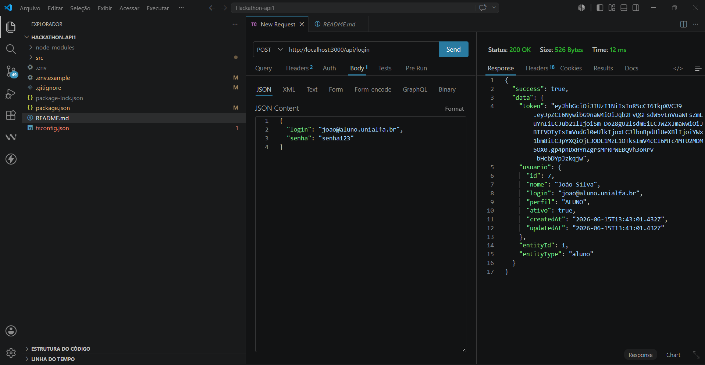

### Cadastro de Aluno
Teste de criação de aluno, retornando `201 Created` e os dados cadastrados.

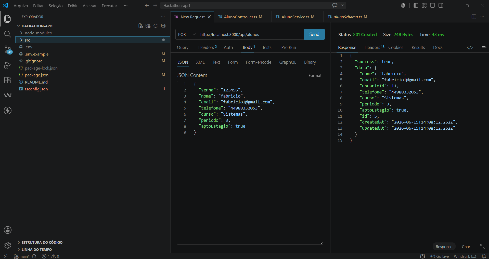

### Listagem de Alunos
Teste de consulta dos alunos cadastrados, retornando `200 OK` e a lista em JSON.

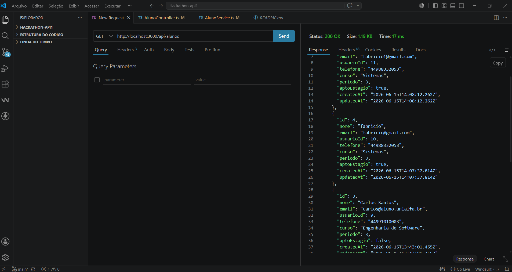

### Atualização de Cadastro de Aluno
Teste de atualização dos dados de um aluno pelo ID, retornando `200 OK`.

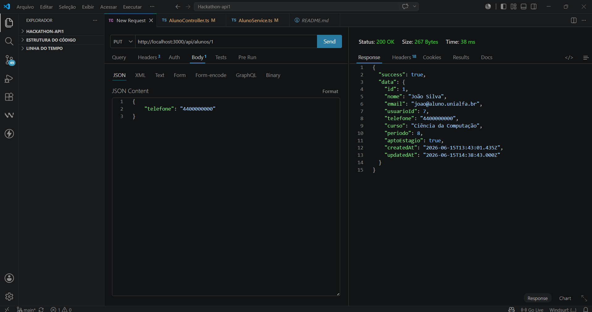

### Cadastro de Empresa
Teste de criação de empresa, retornando `201 Created` e status inicial `PENDENTE`.

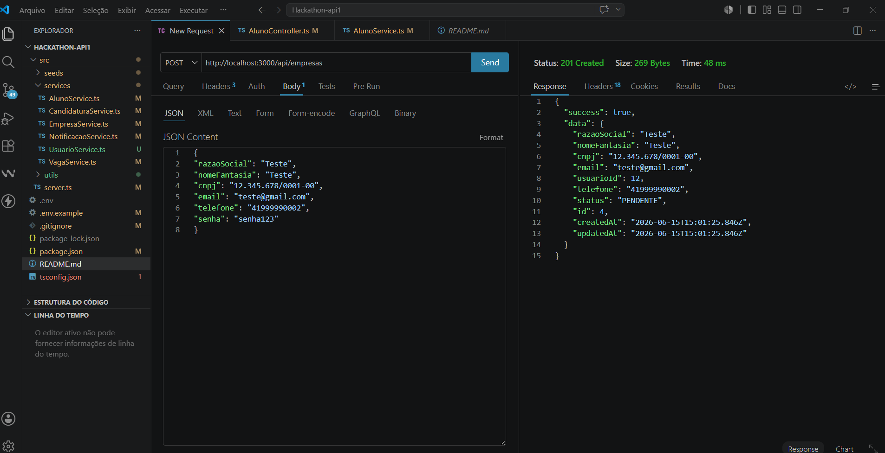

### Listagem de Empresas
Teste de consulta das empresas cadastradas, retornando `200 OK`.

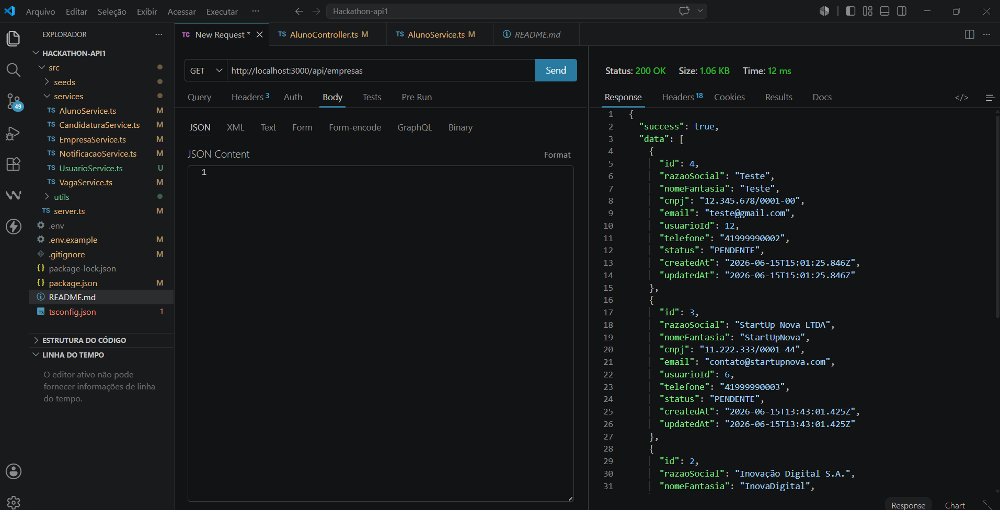

### Busca de Empresa por ID
Teste de busca de uma empresa específica pelo ID informado na rota.

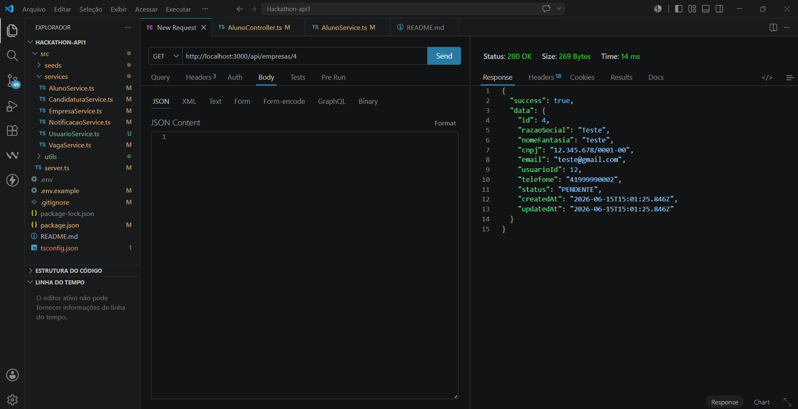

### Bloqueio de Empresa
Teste da rota `PATCH`, alterando o status da empresa para `BLOQUEADA`.

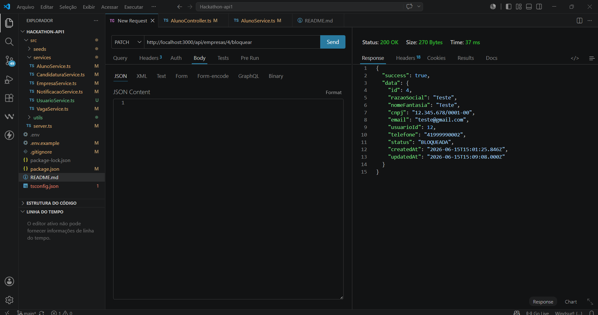

### Aprovação de Empresa
Teste da rota `PATCH`, alterando o status da empresa para `APROVADA`.

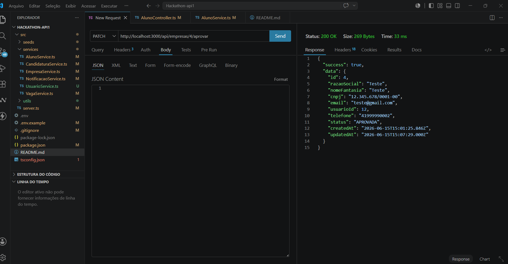

### Exclusão de Empresa
Teste da rota `DELETE`, removendo uma empresa pelo ID e retornando `204 No Content`.


### Conferência da Empresa Removida
Após a exclusão, a listagem foi consultada novamente para confirmar que a empresa não aparece mais no retorno.

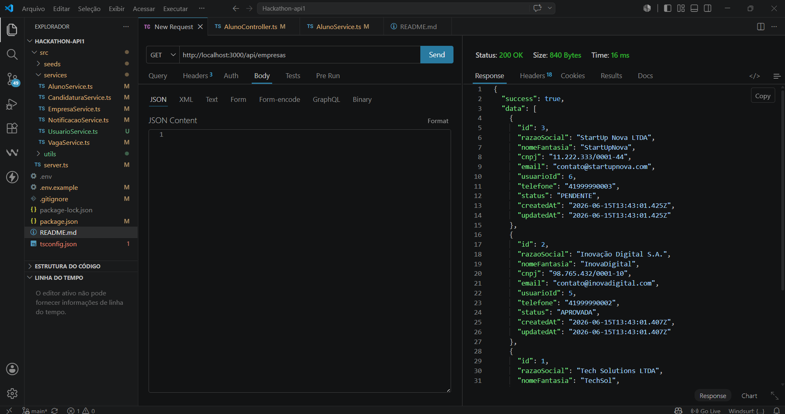

### Listagem de Vagas
Teste de consulta das vagas cadastradas, retornando os dados da vaga e da empresa vinculada.

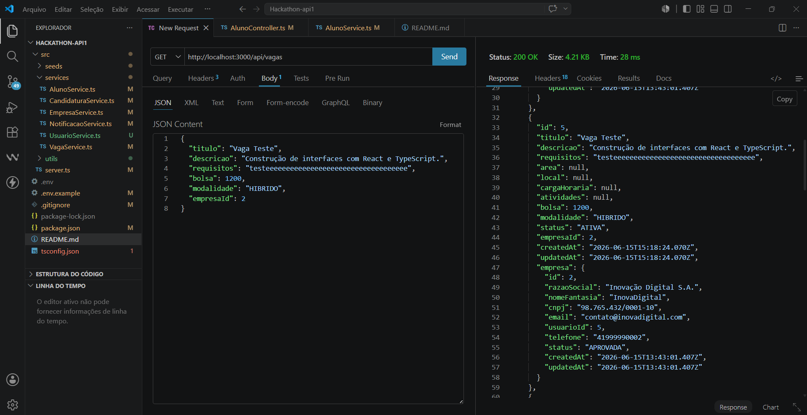

### Criação de Candidatura
Teste de candidatura de um aluno a uma vaga, retornando `201 Created` e status inicial `PENDENTE`.

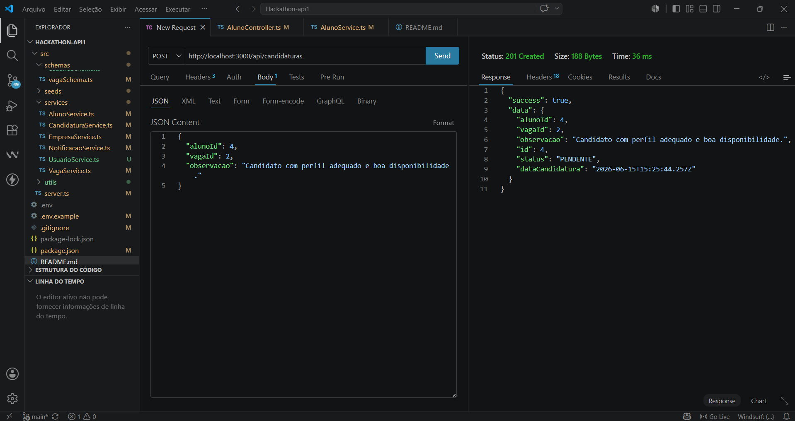

### Listagem de Candidaturas
Teste de consulta das candidaturas, exibindo dados do aluno, da vaga e do status atual.

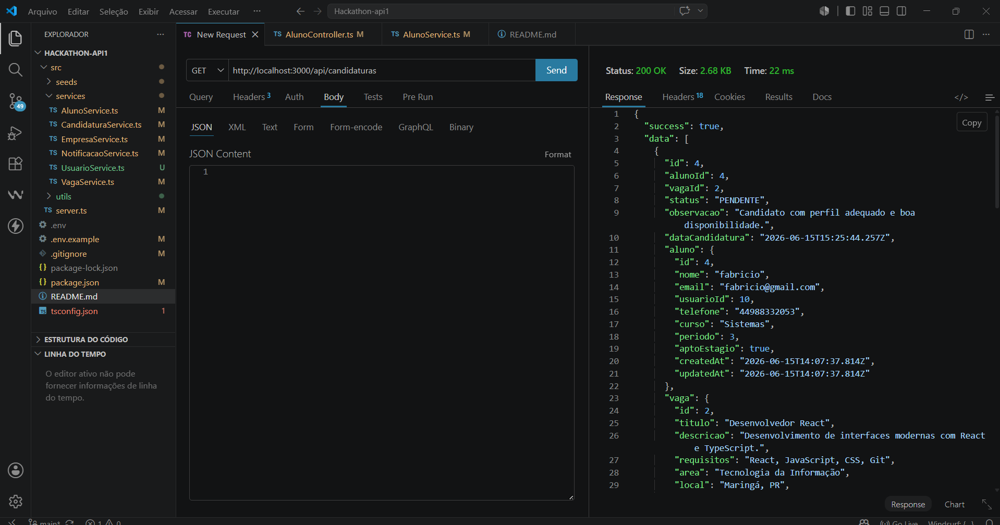

### Exclusão de Candidatura
Teste da rota `DELETE`, removendo uma candidatura pelo ID e retornando `204 No Content`.

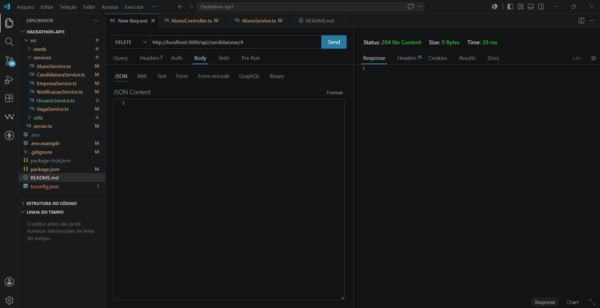

### Consulta de Notificações
Teste de consulta das notificações disponíveis para acompanhamento das candidaturas.

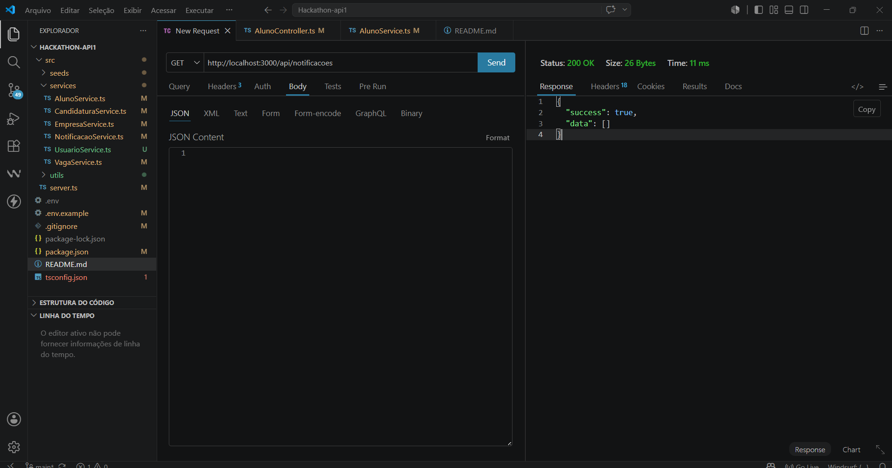

Essas evidências demonstram que as principais rotas da API foram implementadas e testadas, incluindo autenticação, alunos, empresas, vagas, candidaturas e notificações.

---

## Organização e Boas Práticas

O projeto foi organizado em camadas para separar melhor as responsabilidades:

- **Routes:** definem os endpoints da API;
- **Controllers:** recebem as requisições e retornam respostas;
- **Services:** concentram as regras de negócio;
- **Entities:** representam as tabelas do banco;
- **Schemas:** validam os dados com Zod;
- **Migrations:** controlam a estrutura do banco;
- **Seeds:** criam dados iniciais para testes.

Também foram aplicadas boas práticas como validação de dados, padronização de respostas JSON, tratamento de erros, uso de TypeScript e controle de versão com Git.

---

## Conclusão

A API desenvolvida cumpre o papel de motor central do Portal de Estágios UniALFA. Ela permite integrar os módulos do sistema, centralizar o acesso ao banco de dados e gerenciar alunos, empresas, vagas, candidaturas e notificações de forma organizada.

Com os testes realizados, foi possível validar as principais funcionalidades implementadas e confirmar que a API atende aos requisitos principais do Hackathon para o módulo Node.js.
